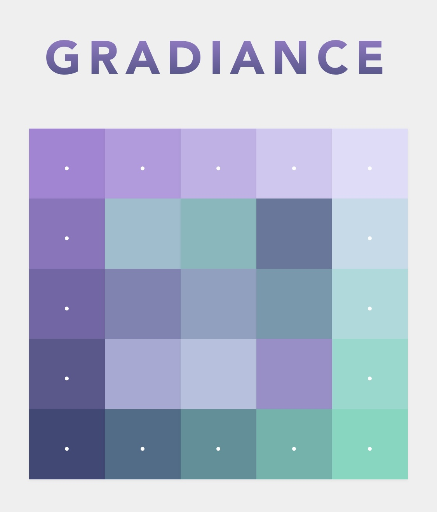
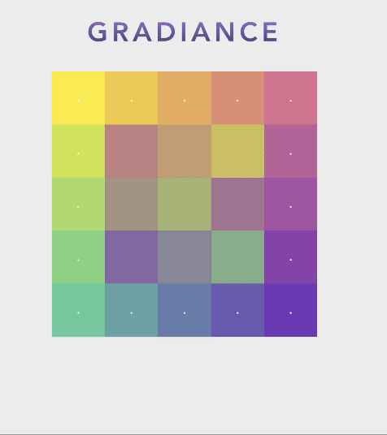

<div align="center">
    
</div>


## What is Gradience?

Gradiance is a relaxing puzzle game.


### How to Play?

Click on two tiles to swap them. Sort the tiles so that the result is smooth color gradient. 

It can be played on both desktop and mobile devices.

<div align="center">
    
</div>


### Inspiration

I was learning Vue 3 and wanted to make something fun in the process. I was playing I Love Hue, and thought it would be a great exercise to make my own version. Coding up this game was a joy!


## Tech Stack

Vue 3, JavaScript, HTML, and CSS.


## Installation

Clone the repo to your local machine, and follow these steps.


Install the packages.

```
npm install
```

To run the game locally:

```
npm run serve
```


This game best runs on web browsers on a computer.